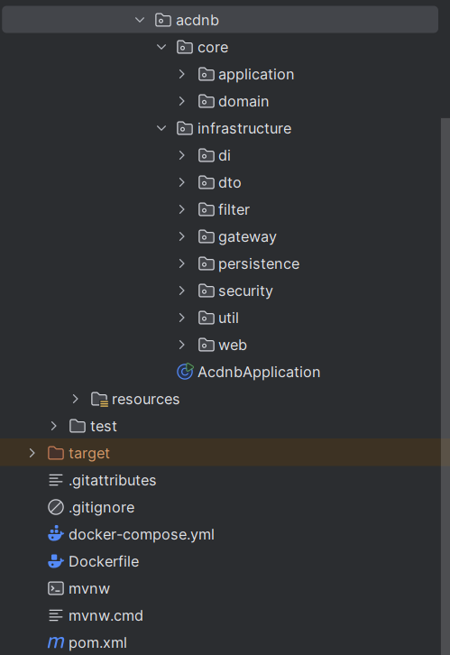

# 🧩 ACDNB-BACKEND

Sistema backend do projeto **SMASH**, responsável pela gestão de pagamentos, controle de usuários, integração com APIs externas e comunicação com o serviço de e-mails.

---

## 🚀 Tecnologias Utilizadas

- **Java 21 (Eclipse Temurin 21)**
- **Spring Boot 3.x**
- **Maven**
- **MySQL**
- **Jakarta Mail**
- **Gemini API**
- **Docker**

---

## ⚙️ Pré-requisitos

Antes de iniciar a instalação, verifique se você possui os seguintes componentes instalados:

| Ferramenta | Versão Recomendada | Observações |
|-------------|--------------------|--------------|
| Java | 21 (Eclipse Temurin) | obrigatório |
| Maven | 3.9+ | usado para build do projeto |
| MySQL | 8.0+ | usado como banco de dados |
| Git | Última versão | para clonar o repositório |
| Docker / Docker Compose | usado para ambiente containerizado |

---

## 🧱 Instalação do Backend

### 1️⃣ Clonar o Repositório

```bash
git clone https://github.com/seu-usuario/ACDNB-BACKEND.git
cd ACDNB-BACKEND
```

---

### 2️⃣ Configurar o Banco de Dados MySQL

Crie o banco de dados manualmente:

```sql
CREATE DATABASE acdnb_db CHARACTER SET utf8mb4 COLLATE utf8mb4_unicode_ci;
```

---

### 3️⃣ Configurar o `application.properties`

No diretório `src/main/resources`, abra o arquivo `application.properties` e configure os seguintes campos essenciais:

```properties
spring.datasource.url=jdbc:mysql://localhost:3306/acdnb_db?useSSL=false&serverTimezone=America/Sao_Paulo
spring.datasource.username=root
spring.datasource.password=sua_senha

spring.jpa.hibernate.ddl-auto=update
spring.jpa.show-sql=true
spring.jpa.properties.hibernate.format_sql=true

spring.mail.host=smtp.gmail.com
spring.mail.port=587
spring.mail.username=seuemail@gmail.com
spring.mail.password=sua_senha_de_aplicativo
spring.mail.properties.mail.smtp.auth=true
spring.mail.properties.mail.smtp.starttls.enable=true

server.port=8080
```

> ⚠️ **Importante:** não insira credenciais pessoais em repositórios públicos.  
> Crie um arquivo `.env` local (ou use variáveis de ambiente) para armazenar dados sensíveis.

---

### 4️⃣ Build do Projeto

Execute o seguinte comando para compilar o projeto e gerar o artefato `.jar`:

```bash
mvn clean package -DskipTests
```

---

### 5️⃣ Executar o Backend

Após o build, execute o backend com:

```bash
java -jar target/acdnb-backend-0.0.1-SNAPSHOT.jar
```

Ou, durante o desenvolvimento:

```bash
mvn spring-boot:run
```

---

## 🧩 Endpoints Principais

| Método | Endpoint | Descrição |
|---------|-----------|-----------|
| `POST` | `/usuarios` | Cria um novo usuário |
| `GET` | `/usuarios/{id}` | Consulta usuário por ID |
| `POST` | `/pagamentos` | Registra pagamento |
| `GET` | `/pagamentos` | Lista todos os pagamentos |
| `GET` | `/pagamentos/status` | Verifica status de pagamentos |

---

## 🧰 Executando com Docker (opcional)

Para subir o backend e o banco de dados juntos, crie um arquivo `docker-compose.yaml`:

```yaml
version: "3.8"
services:
  db:
    image: mysql:8.0
    container_name: acdnb-db
    environment:
      MYSQL_ROOT_PASSWORD: root
      MYSQL_DATABASE: acdnb_db
    ports:
      - "3306:3306"
    networks:
      - acdnb-network

  backend:
    image: acdnb-backend:latest
    container_name: acdnb-backend
    build: .
    ports:
      - "8080:8080"
    depends_on:
      - db
    environment:
      SPRING_DATASOURCE_URL: jdbc:mysql://db:3306/acdnb_db
      SPRING_DATASOURCE_USERNAME: root
      SPRING_DATASOURCE_PASSWORD: root
    networks:
      - acdnb-network

networks:
  acdnb-network:
    driver: bridge
```

Depois execute:

```bash
docker compose up --build
```

---

## 🧑‍💻 Testando a API

Após iniciar o servidor, acesse:
```
http://localhost:8080
```

Para testar os endpoints, use ferramentas como **Postman** ou **Insomnia**.

---

## 🧩 Estrutura de Pastas

```

```

---

## 🧪 Testes

Para executar os testes automatizados:

```bash
mvn test
```
---

## 📜 Licença

Este projeto é de uso **acadêmico e experimental**, sem fins comerciais.
